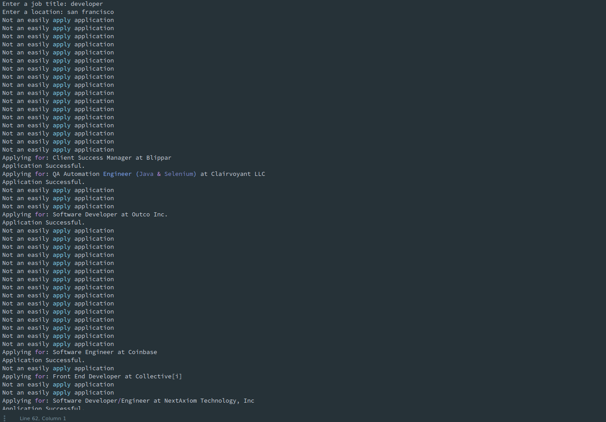

============
Jobautomate
============

Overview
============

Jobautomate uses the Indeed API to apply to 'easily apply' jobs posted to Indeed's website.
Jobautomate comes in two forms. A command line interface (working) and a web application (in development).
Both require user input for first name, last name, and email
address for the user's details. The résumé is uploaded on the web interface
and read from file when using the command line interface. 

Disclaimer: Please be courteous to employers. Nobody enjoys spam emails.

Command Line Interface
======================

To install the script use the following commands in a command line prompt::

    git clone https://github.com/mandeepbhutani/Job-Automate.git
    cd Job-Automate
    python setup.py install

Place a résumé file in the jobautomate subdirectory and then run the script
in a command line prompt using the following command::

    jobautomate

The script will ask for first name, last name, email address, job description,
and job location. Once entered the script will open a Firefox webdriver instance
and search for 'easily apply' jobs in the URLs given by the Indeed API. The output
will look similar to the image below:

Web Application
================

The web application for jobautomate can be found at https://jobomate.herokuapp.com/

The app takes in user input for first name, last name, email address, job description
and job location. The résumé is uploaded via a file input box. Currently, django parses
the file and passes it to the command line script for process. A celery worker needs to
be implemented to run the process in the background in order to stop request timeouts.

